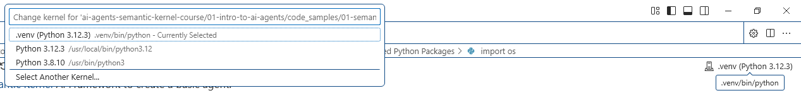
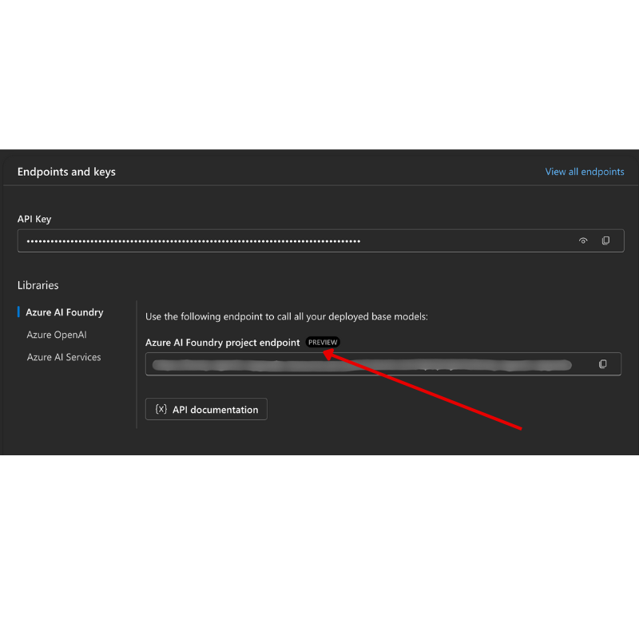

# Course Setup

## Introduction

This lesson will cover how to run the code samples of this workshop.

## Clone or Fork this Repo

To begin, please clone or fork the GitHub Repository. This will make your own version of the course material so that you can run, test, and tweak the code!

This can be done by clicking the link to <a href="https://github.com/aidalgo/ai-agents-workshop/fork" target="_blank">fork the repo</a>

Or just clone to you local repository: 

HTTPS
```bash
git clone https://github.com/aidalgo/ai-agents-workshop.git
```

After cloning:

```bash
cd ai-agents-workshop
ls -la
```

## Running the Code

This course offers a series of Jupyter Notebooks that you can run with to get hands-on experience building AI Agents.

The code samples use either:

**Requires GitHub Account - Free**:

1) Semantic Kernel Agent Framework + GitHub Models Marketplace. Labelled as (semantic-kernel.ipynb)
2) AutoGen Framework + GitHub Models Marketplace. Labeled as (autogen.ipynb)

**Requires Azure Subscription**:
3) Azure AI Foundry + Azure AI Agent Service. Labelled as (azureaiagent.ipynb)

We encourage you to try out all three types of examples to see which one works best for you.

Whichever option you choose, it will determine which setup steps you need to follow below:

## Requirements

- Python 3.12+
  - **NOTE**: If you don't have Python3.12 installed, ensure you install it.  Then create your venv using python3.12 to ensure the correct versions are installed from the requirements.txt file.
- Azure Subscription - For Access to Azure AI Foundry
- Azure AI Foundry Account - For Access to the Azure AI Agent Service

We have included a `requirements.txt` file in the root of this repository that contains all the required Python packages to run the code samples.

You can install them by running the following command in your terminal at the root of the repository:

```bash
pip install -r requirements.txt
```
We recommend creating a Python virtual environment to avoid any conflicts and issues.

## Setup VSCode
Make sure that you are using the right version of Python in VSCode.



## Azure OpenAI Service
- Create an Azure OpenAI resource in the Azure portal
- Deploy a GPT-4o model
- Note your endpoint and deployment name

## Azure AI Foundry Project
- Navigate to Azure AI Foundry
- Create a new AI Project
- Note your project details (subscription, resource group, project name)

### Retrieve Your Azure Project Endpoint


Follow the steps to creating a hub and project in Azure AI Foundry found here: [Hub resources overview](https://learn.microsoft.com/en-us/azure/ai-foundry/concepts/ai-resources)


Once you have created your project, you will need to retrieve the connection string for your project.

This can be done by going to the **Overview** page of your project in the Azure AI Foundry portal.



### Step 2: Create Your `.env` File

To create your `.env` file run the following command in your terminal.

```bash
cp .env.example .env
```

This will copy the example file and create a `.env` in your directory and where you fill in the values for the environment variables.

With your token copied, open the `.env` file in your favorite text editor and paste your token into the `PROJECT_ENDPOINT` field.

### Step 3: Sign in to Azure

As a security best practice, we'll use [keyless authentication](https://learn.microsoft.com/azure/developer/ai/keyless-connections?tabs=csharp%2Cazure-cli?WT.mc_id=academic-105485-koreyst) to authenticate to Azure OpenAI with Microsoft Entra ID. 

Next, open a terminal and run `az login --use-device-code` to sign in to your Azure account.

Once you've logged in, select your subscription in the terminal.

## Additional Environment Variables - Azure Search and Azure OpenAI 

For the Agentic RAG Lesson - Lesson 5 - there are samples that use Azure Search and Azure OpenAI.

If you want to run these samples, you will need to add the following environment variables to your `.env` file:

### Overview Page (Project)

- `AZURE_SUBSCRIPTION_ID` - Check **Project details** on the **Overview** page of your project.

- `AZURE_AI_PROJECT_NAME` - Look at the top of the **Overview** page for your project.

- `AZURE_OPENAI_SERVICE` - Find this in the **Included capabilities** tab for **Azure OpenAI Service** on the **Overview** page.

### Management Center

- `AZURE_OPENAI_RESOURCE_GROUP` - Go to **Project properties** on the **Overview** page of the **Management Center**.

- `GLOBAL_LLM_SERVICE` - Under **Connected resources**, find the **Azure AI Services** connection name. If not listed, check the **Azure portal** under your resource group for the AI Services resource name.

### Models + Endpoints Page

- `AZURE_OPENAI_EMBEDDING_DEPLOYMENT_NAME` - Select your embedding model (e.g., `text-embedding-ada-002`) and note the **Deployment name** from the model details.

- `AZURE_OPENAI_CHAT_DEPLOYMENT_NAME` - Select your chat model (e.g., `gpt-4o-mini`) and note the **Deployment name** from the model details.

### Azure Portal

- `AZURE_OPENAI_ENDPOINT` - Look for **Azure AI services**, click on it, then go to **Resource Management**, **Keys and Endpoint**, scroll down to the "Azure OpenAI endpoints", and copy the one that says "Language APIs".

- `AZURE_OPENAI_API_KEY` - From the same screen, copy KEY 1 or KEY 2.

- `AZURE_SEARCH_SERVICE_ENDPOINT` - Find your **Azure AI Search** resource, click it, and see **Overview**.

- `AZURE_SEARCH_API_KEY` - Then go to **Settings** and then **Keys** to copy the primary or secondary admin key.

### External Webpage

- `AZURE_OPENAI_API_VERSION` - Visit the [API version lifecycle](https://learn.microsoft.com/en-us/azure/ai-services/openai/api-version-deprecation#latest-ga-api-release) page under **Latest GA API release**.

### Setup keyless authentication

Rather than hardcode your credentials, we'll use a keyless connection with Azure OpenAI. To do so, we'll import `DefaultAzureCredential` and later call the `DefaultAzureCredential` function to get the credential.

```python
from azure.identity import DefaultAzureCredential, InteractiveBrowserCredential
```